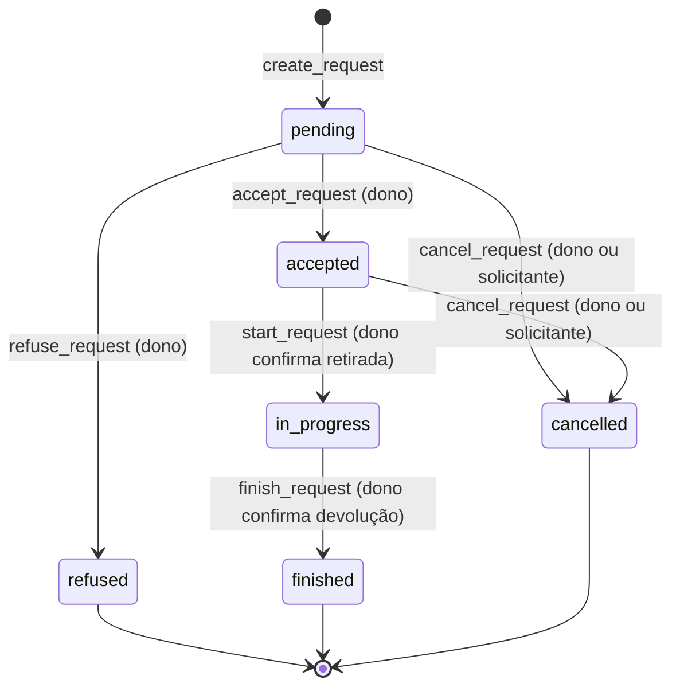
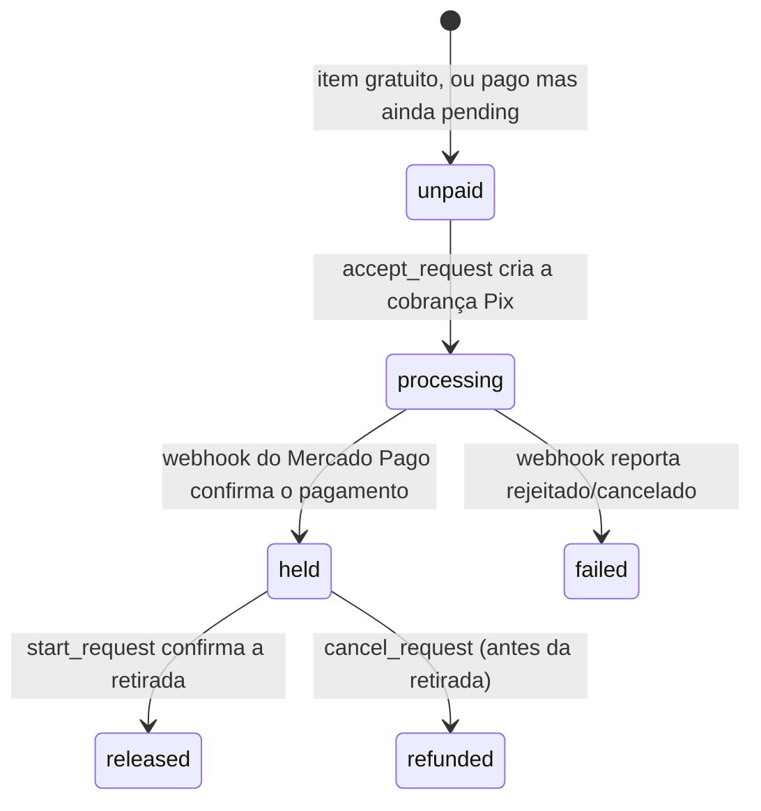

# Ciclo de vida de `LoanRequest` e `Payment`

Como uma solicitação de empréstimo e (quando o item é pago) sua cobrança Pix caminham juntas, do pedido até a devolução. Referenciado a partir de `app/config.py` e `app/models/payment.py` como "docs/pagamento-online" — leia isto antes de mexer em `loan_request_service.py`, `payment_service.py` ou `mercadopago_gateway.py`.

## Os dois campos de estado

Todo `LoanRequest` tem dois campos de status independentes:

- **`status`** — o ciclo de vida do empréstimo em si (`pending`, `accepted`, `refused`, `in_progress`, `finished`, `cancelled`).
- **`payment_status`** — só relevante para itens pagos (`unpaid`, `processing`, `held`, `released`, `refunded`, `failed`). Fica em `unpaid` a vida inteira de um item gratuito.

Eles avançam juntos, mas por gatilhos diferentes: `status` muda quando dono ou solicitante agem na API; `payment_status` muda quando o Mercado Pago confirma algo (via webhook) ou quando o próprio backend libera/estorna no momento certo do fluxo.

**Nota sobre a API do Mercado Pago (2026-08-14)**: a integração usa a API
**Orders** (`POST /v1/orders`), não a antiga Advanced Payments
(`/v1/advanced_payments`) — essa sumiu da documentação oficial do MP e o
SDK Python já não a reconhece mais. A cobrança é criada **como o próprio
dono conectado** (token OAuth dele, não o da plataforma), com
`marketplace_fee` retendo a comissão. Diferença importante: **a API Orders
não suporta `capture_mode: "manual"` pra Pix** (confirmado contra o
sandbox — só vale pra cartão/wallet), então não existe mais o mecanismo de
"reter e liberar depois" que a Advanced Payments tinha
(`money_release_date`). O valor do dono é disbursado pelo Mercado Pago **no
momento em que o Pix é confirmado**, não mais na retirada. Ver o docstring
do módulo em `mercadopago_gateway.py` para os detalhes técnicos.

Existe também um terceiro registro, o documento `Payment` — criado só para itens pagos. Ele é o "livro-razão": guarda `gross_amount`/`platform_fee_amount` **congelados no momento da cobrança** (nunca recalculados a partir de `Item.daily_rate`/`weekly_rate`/`monthly_rate`/`delivery_fee` depois — se o dono editar o preço no meio do caminho, não retroage — o cálculo em si, com as tarifas por período, está em `payment_service._calculate_price`), o QR code do Pix, e os timestamps de cada transição (`held_at`, `released_at`, `refunded_at`).

`Item.delivery_fee` (quando o pedido escolheu `fulfillment_method="delivery"`) entra somado direto no `gross_amount` da cobrança do aluguel, antes de calcular `platform_fee_amount` — ou seja, é taxado pela mesma porcentagem de plataforma que o resto, e sai estornado junto automaticamente num cancelamento pré-retirada (não existe um `Payment` separado só pra entrega; só a extensão tem isso, ver seção abaixo). Só tem efeito em item pago — em item gratuito fica inerte, igual `daily_rate` já fica hoje.

## `Payment.kind` — aluguel vs. prorrogação

`Payment.loan_request` **não é `unique=True`** — um `LoanRequest` pode ter mais de um `Payment` ao longo do tempo, diferenciados por `kind`:

- **`kind="rental"`** — a cobrança do aluguel em si, exatamente uma por `LoanRequest` pago. É essa que segue o diagrama de `payment_status` acima e bloqueia `confirm_pickup` até `held`.
- **`kind="extension"`** — uma cobrança separada, criada por `approve_extension` (`loan_request_service/extensions.py`) quando o dono aprova uma prorrogação num item pago, pelo valor dos dias extras (`payment_service.create_payment_for_extension`). Nada impede pedir mais de uma prorrogação ao longo do empréstimo, então um pedido pode acumular vários `Payment(kind="extension")`.

A prorrogação **não usa o mesmo `payment_status` do `LoanRequest`** — esse campo é e continua sendo só do aluguel original. Uma extensão confirmada não teria como sobrescrevê-lo sem corromper o estado de um pedido que já pode estar `released` há tempos (a extensão só é pedida com o empréstimo já `in_progress`, ou seja, depois que a retirada — e a liberação do pagamento do aluguel — já aconteceu).

Também não existe retenção pra extensão: como o "mais dias" já foi concedido no momento da aprovação (não há nenhum evento futuro tipo "confirmar retirada" pra prorrogação — `_complete_return` nem chama o serviço de pagamento hoje), `handle_webhook` libera automaticamente (`_release_payment_doc`) assim que confirma o Pix da extensão, sem esperar ação humana nenhuma.

Vale reforçar: com a API Orders (ver nota acima), o **dinheiro em si** já foi
disbursado pelo Mercado Pago assim que o Pix é confirmado, seja aluguel ou
extensão — a diferença entre os dois agora é só de **quando o nosso
`payment_status`/`Payment.status` reflete isso**. Extensão reflete na hora
(sempre refletiu). Aluguel só reflete `released` na confirmação de
retirada — mantendo o mesmo gate/UX de sempre — mesmo que o valor já
esteja na conta do dono desde o `held`.

## Diagrama — `LoanRequest.status`

`in_progress` não tem saída para `cancelled` — uma vez retirado o item, o único caminho é `finish_request`. Isso é proposital: `cancel_request` faz estorno total, o que só faz sentido antes da retirada.

## Diagrama — `payment_status` (só itens pagos)

## Onde cada transição acontece

| Transição | Disparada por | O que acontece |
|---|---|---|
| `unpaid → processing` | `accept_request` → `payment_service.create_payment_for_request` | Cria o `Payment` (status `pending`) e a cobrança Pix no Mercado Pago. Nada é gravado se a chamada ao gateway falhar — `payment_status` permanece `unpaid`, um estado seguro e re-tentável. |
| `processing → held` | Webhook `POST /webhooks/mercadopago` → `payment_service.handle_webhook` | Confirmação **assíncrona** — o backend não confia no corpo da notificação, refaz a consulta de status direto na API do Mercado Pago antes de gravar. É neste momento que o Mercado Pago efetivamente disbursa o valor do dono (ver nota sobre a API Orders acima) — mas `payment_status` só chega a `held`, não `released`, pra manter o gate de retirada abaixo funcionando igual a antes. |
| `held → released` | `start_request` (dono confirma retirada) → `payment_service.release_payment` | Bloqueado com 409 até `payment_status == "held"` — o dono não consegue confirmar retirada com o Pix ainda não confirmado. Não há mais chamada de gateway aqui (o dinheiro já foi disbursado no passo acima) — essa transição hoje é só bookkeeping, mantendo o mesmo momento (retirada, não devolução) em que `payment_status` reflete "concluído" pra quem usa a API. |
| `held → refunded` | `cancel_request` (só de `pending`/`accepted`, nunca de `in_progress`) → `payment_service.refund_payment` | Estorno sempre total — não existe estorno parcial neste fluxo. |
| `processing → failed` | Webhook reporta `rejected`/`cancelled` | Fica preso em `failed` — ver limitação abaixo. |

## Risco aceito: estorno pré-retirada com valor já disbursado

Como o dono recebe seu valor assim que o Pix é confirmado (não mais na
retirada, ver nota sobre a API Orders acima), um `cancel_request` entre
`held` e a retirada — janela que ainda existe de verdade, já que a
retirada exige confirmação manual das duas partes — pede um estorno
(`sdk.order().refund()`) sobre um valor que o dono já pode ter recebido.
Confirmado contra o sandbox que o estorno funciona e reverte o split
automaticamente do lado do Mercado Pago, mas isso ainda deixa uma janela
teórica onde o saldo do dono no MP já foi creditado antes de um estorno
reverter — diferente de antes, quando o valor ficava preso na plataforma
até a liberação. Aceito conscientemente como troca pela simplicidade do
modelo atual da API Orders.

## Retry automático na cobrança inicial

Se a chamada ao Mercado Pago em `accept_request` falhar (gateway fora do ar, credencial inválida), `payment_status` fica em `unpaid` em vez de um estado corrompido. Da próxima vez que o solicitante abrir a tela de pagamento (`GET /requests/{id}/payment`), `get_payment_for_request` detecta a ausência de `Payment` num pedido `accepted`/`unpaid`/pago e tenta criar a cobrança de novo — sem exigir nenhuma ação do dono.

## Limitação conhecida

Não existe esse mesmo retry para um pagamento que ficou parado em `processing` — ou seja, a cobrança foi criada com sucesso, mas o webhook de confirmação nunca chegou (Mercado Pago fora do ar na hora de notificar, webhook mal configurado, etc.). Hoje o único jeito de destravar é consultar `mercadopago_gateway.get_payment_status` manualmente. Não é um problema no dia a dia (o webhook é bem confiável), mas é o primeiro lugar a olhar se um pedido pago ficar preso em `accepted`/`processing` por muito tempo.

Prorrogação tem a mesma limitação, sem nenhum retry: se a chamada ao Mercado Pago dentro de `approve_extension` falhar, a extensão já foi aprovada (a data de devolução já mudou) mas nenhuma cobrança existe — hoje isso fica pra resolução manual, não há um mecanismo de nova tentativa como o de `get_payment_for_request`.

## Cobrança em nome da própria plataforma (sinistros — dívida com a Lendly)

`create_pix_charge` recebe `seller_access_token` como parâmetro solto —
nada no SDK exige que seja o token OAuth de um vendedor conectado.
**Confirmado contra o sandbox em 2026-08-20**: passar
`settings.MP_ACCESS_TOKEN` (o token da própria aplicação, hoje usado só
no fluxo OAuth) como `seller_access_token`, com `marketplace_fee_amount=0`,
cria uma Order Pix normalmente (`status: action_required`, QR code válido
gerado) — ou seja, dá pra cobrar alguém em nome da própria Lendly sem
nenhuma integração nova, reaproveitando a função exatamente como está.
Usado pela cobrança de dívida quando a Lendly adianta o valor de um
sinistro ao dono e precisa cobrar quem pegou emprestado de volta (ver
`payment_service.py::create_payment_for_claim_debt`). Como é um token de
aplicação estático (não um OAuth de vendedor com refresh), esse fluxo
**não passa por `mp_connect_service.get_valid_access_token`** — usa
`settings.MP_ACCESS_TOKEN` direto em todo lugar que precisa do token
(criação, consulta de status no webhook, estorno).

## Limitação conhecida: cobrança de sinistro "superseded" paga depois

Quando a Lendly adianta o dono de um sinistro vencido (`claim_service.py::
advance_paid_by_lendly`) ou um admin cancela um sinistro
(`cancel_claim`), a cobrança Pix ativa até então (`Payment.status`) vira
`"superseded"` — mas isso é só bookkeeping local. O QR code em si continua
válido e pagável do lado do Mercado Pago; nada no nosso sistema cancela a
Order de verdade (`mercadopago_gateway.py` não tem `cancel_order`, só
`refund_payment`). Se quem pegou o item emprestado pagar essa cobrança
"superseded" depois — por exemplo, sem saber que a Lendly já cobriu o
valor — o dinheiro cai normalmente na conta do dono (que já recebeu o
adiantamento), e nosso `handle_webhook` só loga um aviso
(`"webhook fired for a superseded payment"`) em vez de processar
automaticamente. Não existe reconciliação automática pra esse caso —
fica pra um admin resolver manualmente ao ver o log.
