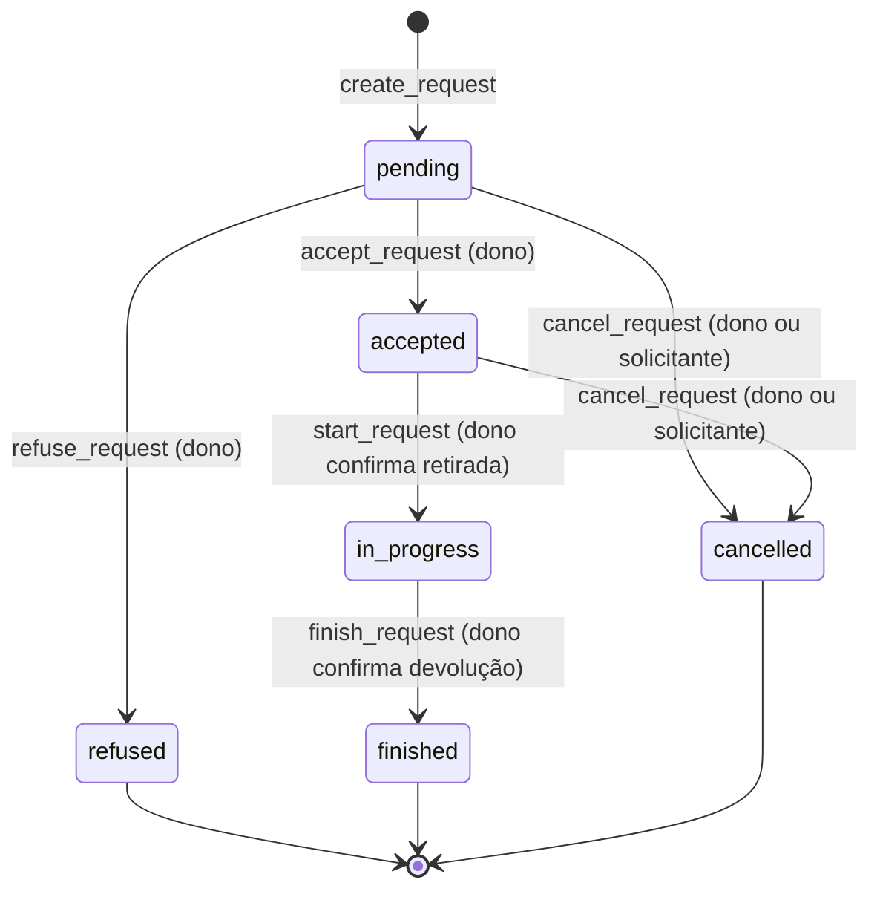
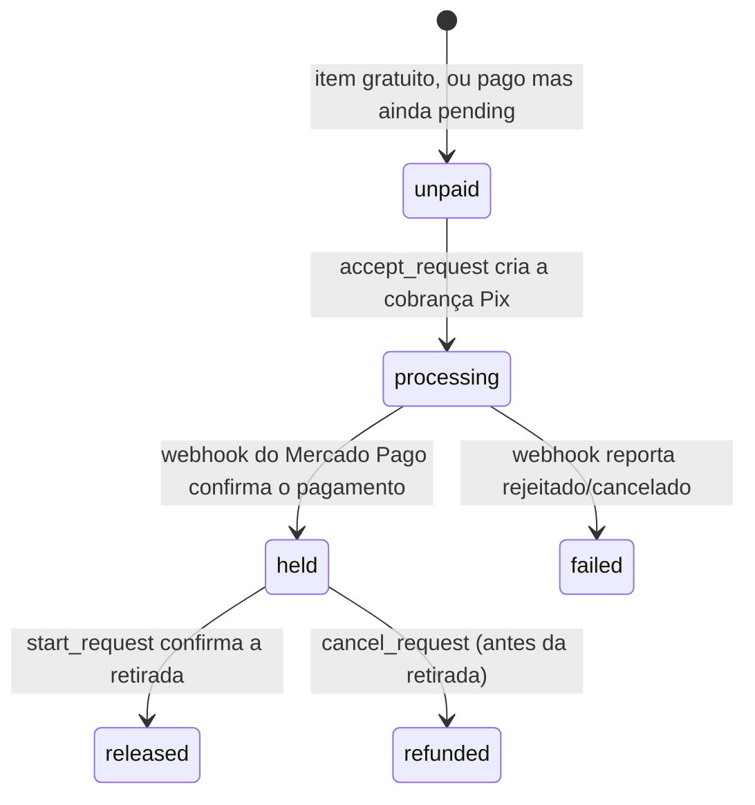

# Ciclo de vida de `LoanRequest` e `Payment`

Como uma solicitação de empréstimo e (quando o item é pago) sua cobrança Pix caminham juntas, do pedido até a devolução. Referenciado a partir de `app/config.py` e `app/models/payment.py` como "docs/pagamento-online" — leia isto antes de mexer em `loan_request_service.py`, `payment_service.py` ou `mercadopago_gateway.py`.

## Os dois campos de estado

Todo `LoanRequest` tem dois campos de status independentes:

- **`status`** — o ciclo de vida do empréstimo em si (`pending`, `accepted`, `refused`, `in_progress`, `finished`, `cancelled`).
- **`payment_status`** — só relevante para itens pagos (`unpaid`, `processing`, `held`, `released`, `refunded`, `failed`). Fica em `unpaid` a vida inteira de um item gratuito.

Eles avançam juntos, mas por gatilhos diferentes: `status` muda quando dono ou solicitante agem na API; `payment_status` muda quando o Mercado Pago confirma algo (via webhook) ou quando o próprio backend libera/estorna no momento certo do fluxo.

Existe também um terceiro registro, o documento `Payment` — criado só para itens pagos, um por `LoanRequest` (`loan_request` é `unique=True`). Ele é o "livro-razão": guarda `gross_amount`/`platform_fee_amount` **congelados no momento da cobrança** (nunca recalculados a partir de `Item.daily_rate` depois — se o dono editar o preço no meio do caminho, não retroage), o QR code do Pix, e os timestamps de cada transição (`held_at`, `released_at`, `refunded_at`).

## Diagrama — `LoanRequest.status`

`in_progress` não tem saída para `cancelled` — uma vez retirado o item, o único caminho é `finish_request`. Isso é proposital: `cancel_request` faz estorno total, o que só faz sentido antes da retirada.

## Diagrama — `payment_status` (só itens pagos)

## Onde cada transição acontece

| Transição | Disparada por | O que acontece |
|---|---|---|
| `unpaid → processing` | `accept_request` → `payment_service.create_payment_for_request` | Cria o `Payment` (status `pending`) e a cobrança Pix no Mercado Pago. Nada é gravado se a chamada ao gateway falhar — `payment_status` permanece `unpaid`, um estado seguro e re-tentável. |
| `processing → held` | Webhook `POST /webhooks/mercadopago` → `payment_service.handle_webhook` | Confirmação **assíncrona** — o backend não confia no corpo da notificação, refaz a consulta de status direto na API do Mercado Pago antes de gravar. |
| `held → released` | `start_request` (dono confirma retirada) → `payment_service.release_payment` | Bloqueado com 409 até `payment_status == "held"` — o dono não consegue confirmar retirada com o Pix ainda não confirmado. O valor é liberado pro dono **no momento da retirada**, não na devolução: uma vez o item físico na mão do solicitante, a obrigação do dono já foi cumprida. |
| `held → refunded` | `cancel_request` (só de `pending`/`accepted`, nunca de `in_progress`) → `payment_service.refund_payment` | Estorno sempre total — não existe estorno parcial neste fluxo. |
| `processing → failed` | Webhook reporta `rejected`/`cancelled` | Fica preso em `failed` — ver limitação abaixo. |

## Retry automático na cobrança inicial

Se a chamada ao Mercado Pago em `accept_request` falhar (gateway fora do ar, credencial inválida), `payment_status` fica em `unpaid` em vez de um estado corrompido. Da próxima vez que o solicitante abrir a tela de pagamento (`GET /requests/{id}/payment`), `get_payment_for_request` detecta a ausência de `Payment` num pedido `accepted`/`unpaid`/pago e tenta criar a cobrança de novo — sem exigir nenhuma ação do dono.

## Limitação conhecida

Não existe esse mesmo retry para um pagamento que ficou parado em `processing` — ou seja, a cobrança foi criada com sucesso, mas o webhook de confirmação nunca chegou (Mercado Pago fora do ar na hora de notificar, webhook mal configurado, etc.). Hoje o único jeito de destravar é consultar `mercadopago_gateway.get_payment_status` manualmente. Não é um problema no dia a dia (o webhook é bem confiável), mas é o primeiro lugar a olhar se um pedido pago ficar preso em `accepted`/`processing` por muito tempo.
